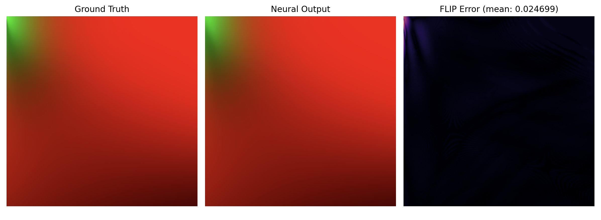

# BRDF LUT MLP

A small MLP trained to approximate the split-sum BRDF integration lookup table used in IBL rendering, replacing a precomputed 512×512 texture with a learned function.

## Architecture

6-layer MLP with GELU activations and a Sigmoid output layer. Takes NdotV and roughness as inputs and outputs the scale and bias terms of the split-sum approximation.

| Parameter      | Value                            |
| -------------- | -------------------------------- |
| Inputs         | 2 (NdotV, roughness)             |
| Outputs        | 2 (scale, bias)                  |
| Hidden layers  | 6x128                            |
| Activation     | GELU (hidden), Sigmoid (output)  |
| Loss           | MSE                              |
| Optimizer      | Adam (lr=1e-3)                   |

## Results

| Metric                | Value                  |
| --------------------- | ---------------------- |
| Training time         | 48.4s (30 epochs)      |
| Inference (512x512)   | 259.7ms                |
| Model size            | 329.5 KB               |
| Raw LUT size          | 2048 KB                |
| Compression ratio     | 6.2x                   |
| Mean FLIP error       | 0.024699               |
